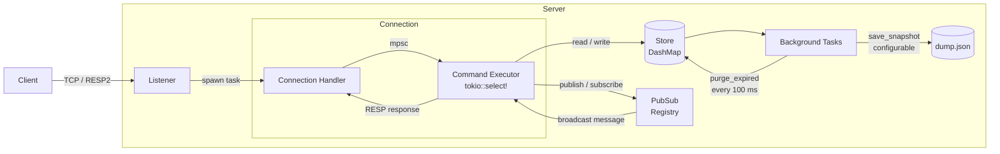

# Asynchronous In-Memory Key-Value Database Server Inspired by Redis

**Authors:** Yurii Oliinyk, Vadym Popovych

---

## 1. Introduction

We built a simplified in-memory key-value server inspired by Redis. It accepts multiple TCP connections simultaneously, stores and retrieves data through a subset of Redis commands, supports real-time messaging between clients via publish/subscribe, and persists data to disk so state survives server restarts. Clients can connect using the standard `redis-cli` tool or the bundled `litredis-cli` binary included in the project.

A big advantage of our project is that this server is compatible with any kind of real redis clients through implemented RESP2 protocol(but including the fact that list of implemented commands is not such big as in the real redis) 

The motivation was clear: gain experience with asynchronous Rust and networking, and understand how a system like Redis actually works under the hood, not just how to use it. Applications frequently need a fast, shared place to store temporary data such as user sessions, counters, or messages between services. An in-memory server handles this far faster than a traditional database because there is no disk access on every read or write.

---

## 2. Requirements

The server must handle multiple simultaneous client connections over TCP and communicate using the Redis Serialization Protocol (RESP), ensuring compatibility with existing Redis clients.

**Core key-value commands:**
- `SET key value [EX seconds]` - store a value, optionally with a TTL
- `GET key` - retrieve a value
- `DEL key` - remove a key
- `EXISTS key` - check whether a key is present
- `INCR / DECR / INCRBY key [delta]` - increment or decrement a numeric value
- `EXPIRE key seconds` / `TTL key` / `PERSIST key` - manage key expiration
- `COPY source destination [REPLACE]` - copy a key with its TTL

**Utility commands:** `PING`, `ECHO`

**Publish/subscribe:**
- `SUBSCRIBE channel [...]` - receive messages on one or more channels
- `PUBLISH channel message` - broadcast a message to all subscribers
- `UNSUBSCRIBE [channel ...]` - stop receiving messages

**Authentication:** optional password protection via `AUTH password`

**Expiration:** keys with a TTL are automatically removed in the background.

**Persistence:** the store is saved to a JSON snapshot file periodically and on shutdown; it is restored on startup, with expired entries filtered out.

**Configuration:** port, host, snapshot path, flush interval, and password can all be set via CLI flags or a JSON config file.

**Compatibility:** server can be accessed from any redis client

---

## 3. Design Diagram

Global state (`Arc<Shared>`) holds the config, store, and pub/sub registry and is cloned cheaply into each connection task. The reader and executor within a single connection run concurrently - the reader pushes parsed commands onto an `mpsc` channel, and the main loop picks them up alongside any incoming pub/sub messages using `tokio::select!`.

---

## 4. Design Choices

### Concurrent data store: `DashMap` vs. `RwLock<HashMap>`

We used `DashMap`, a lock-free sharded concurrent hashmap, instead of wrapping a standard `HashMap` in a `RwLock`. A single `RwLock` becomes a global bottleneck when many clients read and write simultaneously. `DashMap` shards its entries internally, so different keys can be accessed in parallel without contention.

### Async runtime: Tokio

We chose Tokio over alternatives such as `async-std` or `smol` because it has the widest ecosystem - in particular its channels (`mpsc`, `broadcast`), timers, and `tokio-test` utilities were all used heavily. The `tokio::select!` macro made it straightforward to multiplex several async event sources inside a single connection task.

### TTL tracking: `Instant` vs. `SystemTime`

Expiration deadlines are stored as `std::time::Instant` values rather than Unix timestamps. `Instant` is monotonic - it is unaffected by system clock adjustments - so a clock change cannot cause keys to expire too early or too late. The only complication is that `Instant` cannot be serialized directly; when saving a snapshot we convert the remaining TTL to a duration in seconds, and when loading we reconstruct a new `Instant` from the current time plus that duration.

### Persistence: atomic rename

The snapshot is first written to a temporary file and then renamed into place. A direct overwrite would leave a partially-written, corrupt file if the process crashed mid-write. The rename is atomic on all major operating systems, so the snapshot is always either the old complete version or the new complete version.

### Backpressure for slow pub/sub subscribers

Each subscriber receives messages through a bounded `mpsc` channel (capacity 1024). If a subscriber's channel is full when a message is published, we treat that client as a slow consumer and disconnect it rather than blocking the publisher or buffering indefinitely. This prevents a single slow client from stalling all other subscribers or exhausting server memory.

### Error handling: `anyhow` + custom `ProtocolError`

Server-internal errors use `anyhow` for ergonomic propagation with context. Protocol-level errors use a custom `ProtocolError` enum with specific variants (`UnknownCommand`, `InvalidArgument`, etc.) because the RESP encoder needs to format them as structured Redis error strings (`-ERR ...`). Using custom exceptions keeps responses more structured.

---

## 5. Dependencies

| Crate | Version | Purpose |
|---|---|---|
| `tokio` | 1.52 | Async runtime, TCP server, tasks, `mpsc`/`broadcast` channels, timers |
| `dashmap` | 6.1 | Lock-free sharded concurrent hashmap for the key-value store |
| `bytes` | 1.11 | Efficient byte-buffer utilities used in the RESP parser |
| `serde` + `serde_json` | 1.0 | Serialize and deserialize the store to/from a JSON snapshot file |
| `clap` | 4.6 | CLI argument parsing with derive macros for the server and CLI client |
| `anyhow` | 1.0 | Ergonomic error propagation with contextual messages throughout the server |
| `log` + `env_logger` | 0.4 / 0.11 | Structured logging controlled via the `RUST_LOG` environment variable |
| `tokio-test` | 0.4 | Async test utilities (dev dependency) |

---

## 6. Evaluation

### What went well

Most of the problems could have happened with concurrency as we thought, but they were successfully solved

**`tokio::select!` made concurrent connection logic clean.** Multiplexing incoming commands, pub/sub messages, and disconnect signals inside a single task was straightforward once we understood the pattern. The alternative - separate threads with mutexes - would have been considerably noisier and not in our learning scope.

**`DashMap` made shared state almost invisible.** Multiple tasks read and write the store concurrently with no explicit locking in application code in help with sharding concept.

### What did not go as well

**The borrow checker added friction around async task boundaries.** Passing mutable session state into `tokio::spawn` closures required more `Arc` wrapping than initially expected, and the split between `connection.rs` and `session.rs` was partly driven by lifetime constraints rather than pure design preference.

**RESP parsing is verbose in Rust.** Matching on byte patterns with explicit error variants produces noticeably more code than equivalent Python or Go. It is really just idiomatic RUST, but the fact is the initial implementation took longer than expected.

### Rust for a project of this size

Actually this type of project fits Rust best. A networked server with shared mutable state and strict latency requirements is exactly the problem domain Rust was designed for. The language gives you the control of C - no garbage collector pauses, deterministic memory layout, zero-cost async.
