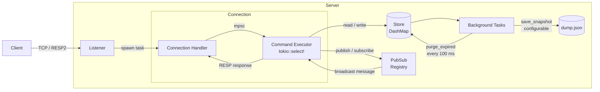

# litredis

Lightweight asynchronous in-memory key-value server inspired by Redis, written in Rust. Compatible with standard Redis clients via the RESP2 protocol.

## Features

- **RESP2 protocol** - connect with `redis-cli`, `redis-py`, or any standard Redis client
- **Concurrent connections** - each client runs in its own async Tokio task
- **Publish/subscribe** - real-time messaging between clients
- **Key expiration** - TTL support with automatic background cleanup
- **Persistence** - JSON snapshots saved periodically and on shutdown, restored on startup
- **Authentication** - optional password protection via `AUTH`
- **Flexible config** - CLI flags or a JSON config file

## Supported Commands

### Key-Value

| Command | Description |
|---|---|
| `SET key value [EX seconds]` | Store a value, optionally with a TTL |
| `GET key` | Retrieve a value |
| `DEL key [key ...]` | Remove one or more keys |
| `EXISTS key` | Check whether a key is present |
| `COPY source destination [REPLACE]` | Copy a key along with its TTL |
| `INCR key` | Increment a numeric value by 1 |
| `DECR key` | Decrement a numeric value by 1 |
| `INCRBY key delta` | Increment a numeric value by `delta` |
| `DECRBY key delta` | Decrement a numeric value by `delta` |

### Expiration

| Command | Description |
|---|---|
| `EXPIRE key seconds` | Set a time-to-live on a key |
| `TTL key` | Query remaining time-to-live (-1 if none, -2 if missing) |
| `PERSIST key` | Remove the TTL from a key |

### Pub/Sub

| Command | Description |
|---|---|
| `SUBSCRIBE channel [...]` | Start receiving messages on one or more channels |
| `PUBLISH channel message` | Broadcast a message to all subscribers |
| `UNSUBSCRIBE [channel ...]` | Stop receiving messages |

### Utility

| Command | Description |
|---|---|
| `PING [message]` | Healthcheck; returns `PONG` or echoes the message |
| `ECHO message` | Echo a message back |
| `AUTH password` | Authenticate when the server has a password set |

## Usage

Start the server:

```bash
cargo run --bin redis-app
```

Start the bundled interactive CLI:

```bash
cargo run --bin litredis-cli -- --host 127.0.0.1 --port 9736
```

Or connect with the standard Redis CLI:

```bash
redis-cli -p 9736
```

### Quick examples

```text
PING
SET session:1 "hello world" EX 60
GET session:1
TTL session:1
INCR counter
SUBSCRIBE news
PUBLISH news "hello subscribers"
```

## Demo

`demo.py` exercises the server using the real `redis-py` client, covering all major feature areas: PING/ECHO, SET/GET/DEL/EXISTS, counters, TTL, COPY, and pub/sub.

**Requirements:** Python 3.10+ and the `redis` package.

```bash
pip install redis
```

Start the server, then run the script:

```bash
cargo run --bin redis-app
python demo.py
```

The script prints a colour-coded summary of each command and its result. The AUTH section is skipped by default; to test it, start the server with a password:

```bash
cargo run --bin redis-app -- --password secret
```

Then update the `connect()` call in `demo.py` accordingly, or pass the password via the `redis-cli`:

```bash
redis-cli -p 9736 -a secret
```

## Configuration

Options can be passed as CLI flags or provided in a JSON config file (`--config-file path/to/config.json`).

| Flag | Default | Description |
|---|---|---|
| `--host` | `0.0.0.0` | Host to listen on |
| `--port` | `9736` | Port to listen on |
| `--snapshot-path` | `dump.json` | Path for the persistence snapshot |
| `--flush-interval` | `300` | Seconds between background snapshots |
| `--password` | _(none)_ | Require `AUTH` before any command |
| `--no-persistence` | _(off)_ | Disable snapshotting entirely |

Example config file:

```json
{
  "host": "127.0.0.1",
  "port": 6379,
  "snapshot_path": "data/dump.json",
  "flush_interval": 60,
  "password": "secret"
}
```

## Dependencies

| Crate | Purpose |
|---|---|
| `tokio` | Async runtime, TCP server, channels, timers |
| `dashmap` | Lock-free sharded concurrent hashmap for the store |
| `bytes` | Byte-buffer utilities for the RESP parser |
| `serde` + `serde_json` | Snapshot serialization |
| `clap` | CLI argument parsing |
| `anyhow` | Error propagation |
| `log` + `env_logger` | Logging via `RUST_LOG` |

## Diagram


